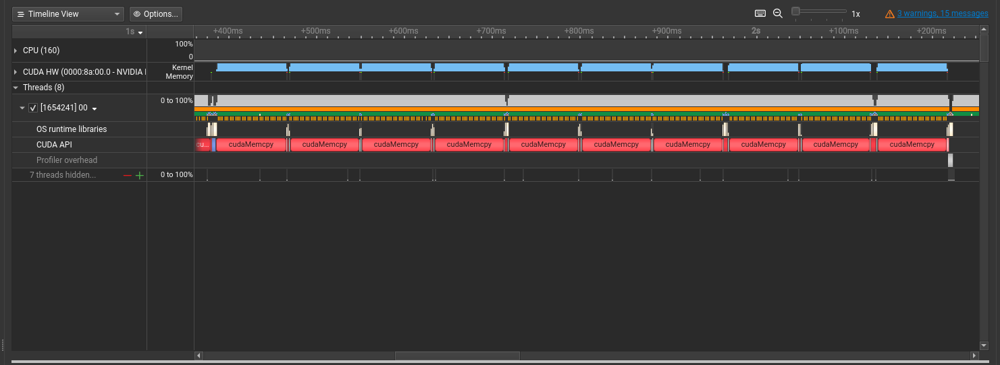
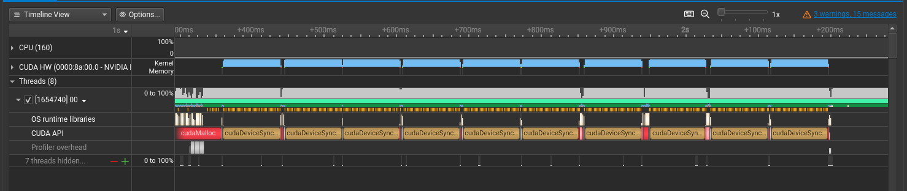
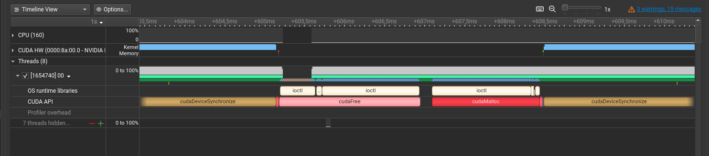
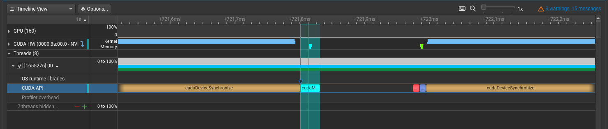

In this lab, you will start learning how to profile GPU workloads and optimize them. This is important because you typically want not just to run some workload on the GPU but also utilize resources of not-so-cheap GPU as much as possible.

## GPU Architecture Background

Before we start, let's first understand the GPU archirecture since it is important to work on CUDA workloads performance.

The GPU architecture is different from the classical computer architecture since they are designed to handle different workloads. CPUs are optimized to handle mostly serial workloads while GPUs are designed to execute the same code on the big amount of data. We will see how it affects the architecture.

The most basic component of the GPU is CUDA core which is similar to the CPU core in sense that it executes instructions in a serial manner. In terms of CUDA programming model CUDA core just executes a single thread of a kernel. The difference is that GPU has much more cores than CPU (for example, NVIDIA H100 almost 17k CUDA cores) but these cores are simpler than CPU cores since they are designed for a specific workload. Also, CUDA cores usually have smaller frequency than CPU cores, so on a single-threaded programs, CPU are usually faster than GPUs even on floating-point operations.

A Streaming Multiprocessor or just SM is a cluster of CUDA cores that can execute multiple threads concurrently. Also, SM contains a set of registers and shared memory that can be used by threads running on the cores of the SM. That is, block of the threads is always executed on a single SM. When a block is assigned to some SM, its threads are divided into warps. A warp is a group of 32 threads that are executed in a [SIMD](https://en.wikipedia.org/wiki/Single_instruction,_multiple_data) manner. There are more than 32 cores in a SM, so SM can execute multiple warps simultaneously. Warp scheduler is responsible for selecting warps to execute on SM.

When warp is executed it is expected that all threads are executing the same instruction simultaneously. If some threads are executing different instructions, then the parallelism and thus the performance is decreased. This is called warp divergence. We will see examples of the warp divergence in this lab later.

Summarizing, GPU consists of a CUDA cores that are groupped into SMs. A block of threads is executed on a single SM and its threads are divided into warps. When warp is exectuted, its threads are running on SM cores.

Another important topic is GPU memory hierarchy. There are many types of memory on the GPU but now we will focus only on some of them.

Global memory is the main memory of the GPU. It is accessible from all the threads, just like a regular RAM. In a previous lab, you already used global memory when allocated it via `cudaMalloc`. Global memory is the largest but slowest memory on the GPU, so it is important to minimize the number of accesses to it. In a modern NVIDIA H100 GPU, the global memory size is 80GB and the bandwidth is up to 3TB/s. This is much more than the CPU memory bandwidth but is still not sufficient for some workloads since the number of threads reading from the global memory in parallel is much higher than in the case of regular CPU programs.

Shared memory is the memory that is located inside the SM and is shared between threads in the block. It is much faster than global memory but it is much smaller than global memory. In a modern NVIDIA H100 GPU, the shared memory size is 164KB per SM and the bandwidth can go up to tens of TB/s. It's worth mentioning that shared memory is not homogeneous and is divided into multiple banks. During the single cycle only one operation per bank can be performed, so different threads should work with different banks to avoid bank conflicts resulting in performance degradation. We will see examples of bank conflicts in this lab later.

The fastest memory on the GPU are registers. Just like in the CPU, registers belong to a single core and thus accessible from the single thread. In a modern NVIDIA H100 GPU, the number of registers per CUDA core is 256.

Also similarly to CPU, there are caches on the GPU. L1 cache is located in the SM and is shared between all the cores (and threads) of it. It sits between SM and main memory and caches data from the global memory that is frequently accessed or was recently written. In NVIDIA H100 L1 cache and shared memory share the same space of the SM, so 256KB of the SM memory can be configurably shared between them.

L2 cache is located near the global memory and is shared between SMs. It caches data from the global memory that is frequently accessed by the SMs. In NVIDIA H100 L2 cache size is 40MB.

This was just a brief overview of the GPU internals. If you are interested in more details, you can read the whitepaper of the architecture of some modern GPU (for example, the one you use). [Here](https://resources.nvidia.com/en-us-tensor-core/gtc22-whitepaper-hopper) is an example of such whitepaper for NVIDIA H100 GPU.

Take a look at the specification of the GPU you have access to. What is the amount of global memory, number of SM and memory bandwidth? How many CUDA cores are there and what is their frequency? Compare it with the characteristics of the regular CPU and RAM.

## NVIDIA Nsight

NVIDIA Nsight is a family of profiling tools by NVIDIA that are used to investigate the performance of the GPU workloads. In this lab, we will look at NVIDIA Nsight Systems and NVIDIA Nsight Compute.

NVIDIA Nsight Systems is a system-wide performance analyzer. It collects events from both CPU, GPU and GPU interconnect and puts them on a single timeline. It is useful to get a bird's eye view of the application performance and understand how wall time is distributed between different parts of the program and devices. On the other side, it does not provide detailed information about what happens inside the kernel like `perf` tool for the CPU workloads. To get a detailed view of the kernel execution, we will use another tool called NVIDIA Nsight Compute.

Both of these tools have excellent documentation (see [Nsight Systems](https://docs.nvidia.com/nsight-systems/) and [Nsight Compute](https://docs.nvidia.com/nsight-compute/)). It is definitely not required to read all of it to use these tools, but it is a good idea at least to look at the list of possible options and metrics that can be collected in order to understand the limitations of these tools. Simple usages of these tools will be shown in this lab later.

## 00: First steps with Nsight Systems

Now it is the time to make your hands dirty and profile something. In this task you will profile program that is located in file `00.cu`.

Take a look at the code. What does it do?

<details>
<summary> Answer </summary>

This code does the following procedure for 10 times. Allocate a vector of 1000 numbers, do some CPU processing, then do GPU processing. For the GPU processing data is copied to GPU and vice versa.

</details>

Now compile the code with the following command and run the profiling.

```bash
make 00
nsys profile -o 00.prof ./00
```

This will generate a file `00.prof.nsys-rep` with the profiling results. Download it locally if required and open it with NVIDIA Nsight Systems GUI.

You will see a timeline with the CPU and GPU events. Play with it to become comfortable with the tool. Try zooming timeline in and out, clicking on the events to get detailed information. Unroll sections for the CPU and GPU and look at them.

Zoom to the time interval when kernels were executing. You will see something like this.



Look at the CUDA API section of the main thread. You will see alternating long `cudaMemcpy` calls.

Why `cudaMemcpy` calls are so long and why do not we see the kernels here?

<details>
<summary> Answer </summary>

`cudaMemcpy` performs synchronization between CPU and GPU that waits until all the previous GPU operations are finished. So it includes both the real data transfer and waiting for the kernel completion.

You can unroll CUDA HW section and see that most of the `cudaMemcpy` call time is spent on the GPU running kernel and only a small amount of time is spent for copying data.
</details>

Add an explicit `cudaDeviceSynchronize` call after the kernel launch and rerun the profiling. You should see something like this.



Now you can see that most of the CPU time is spent on the `cudaDeviceSynchronize` call waiting for the kernel to finish. Look at the `CUDA HW` timeline. It shows that kernels are executed in the same time as synchronization blocks.

However, not 100% of the time is spent in `cudaDeviceSynchronize` calls. Also, there are gaps between kernel launches at `CUDA HW` timeline, so GPU is not 100% utilized. Let's zoom in and look what happens between kernels. You will see something like this.



`cudaMalloc` and `cudaFree` are the most expensive here, consuming about 85% of the gaps. Do you see any way to get rid of them? Try to implement it and then check the answer.

<details>
<summary> Answer </summary>
You can allocate a buffer once before the first kernel execution and free it after the last. Reusing the memory will save time on memory management here.

The pattern of static memory allocation is actually quite common in the GPU prograaming because programs are often more predictable than CPU ones. It allows to use static memory layout in many cases.
</details>

Look at the gap now. You will see something like this.



`cudaMalloc` and `cudaFree` calls are gone and the gap became much smaller. `cudaMemcpy` is still here because we need to copy data between CPU and GPU. Also there is an empty space on both `CUDA API` and `CUDA HW` timelines. What is it?

<details>
<summary> Answer </summary>

This is regular CPU workload that is not related to the GPU. In our case it is just filling the input vector.

</details>

Actually this can be optimized even more by building a better pipeline. Since CPU and GPU are independent, we can start preparing the next batch of data while the previous one is being processed on the GPU. Since kernel executions are asynchronous, it is not so hard to implement. Try to do it and check if the gap became even smaller.

Pipelining is a common pattern when optimizing GPU (and not only GPU) workloads. When optimizing a chain of different operations it's a good idea to look at the pipeline first and get rid of possible unnessesary barriers before optimizing the operations themselves.

This trick can be even performed with `cudaMemcpy` calls in some cases by using `cudaMemcpyAsync` function. It is a little bit tricky sometimes because may lead to races and we will not use it during our course. However, I recommend you to take a look at it.

Now, when everything look good at system-wise level, let's go deeper and profile the kernel itself. It can be done with the following command. This command may take a while to execute, so you can reduce the number of kernel runs to make it faster.

```bash
ncu --set full -o 00.prof ./00
```

`--set full` option tells Nsight Compute to collect all the possible metrics. This will allow you to look at all the profiler capabilities, but has a big performance overhead and produces profiles of a big size. In future exercies it's recomended to use more specific metrics. Usually, it's a good idea to start with the basic set of metrics (without providing `--set` option) and then add more metrics if needed.

The command will generate a file `00.prof.ncu-rep` with the profiling results. Let's inspect it with NVIDIA Nsight Compute GUI. Note, that Nsight Compute GUI is a different program than Nsight Systems GUI and one will not open profiles of the other.

Let's explore the profile. On the summary tab you will see all the kernel launches. For each of them name, duration, thread count and other basic metrics are shown.

When trying to optimize the kernel, one of the important things to understand is whether the kernel is memory bound or compute bound. Compute bound kernels are kernels that are limited by the computational capabilities of the GPU (i.e. if the number of operations per second of CUDA cores increases the kernel execution time will decrease). Memory bound kernels are limited by the memory bandwidth of the GPU (i.e. if the number of memory accesses per second increases the kernel execution time will decrease).

You can double click on the launch to see detailed information on the details tab. It has different metrics as well as some perfomance improvement advices. At the first glance, it may look like a spaceship control panel with many different metrics and warnings. Note, that many of the warnings may be false positives, so make sure that something is really a problem before trying to fix it.

Look at the "Launch Statistics" section. Nsight Compute already found what the problem is and tells us that block size is too small. Try to fix it according to a suggestion and set the number of threads per block to 256. Rerun the profiling and compare the results. You should see a significant speedup.

For example, consider the message "Low Utilization" in "Compute Workload Analysis". What does it mean? Why did it happen? How can you fix it?

Fix the problem and rerun the profiling. Compare workload analysis before and after the fix. Did your fix help?

<details>
<summary> Answer </summary>

Error message means that warps are not fully utilize the compute. This is because we have only one thread per block, so the warp is not full and we do not take advantage of the SIMD processing. To fix it, increase the number of threads per block to, say, 256.

</details>

That's it for now! You did your first kernel optimizations using NVIDIA Nsight. Before moving to the next task, I suggest you to play a little bit with Nsight Systems and Nsight compute to get more familiar with them. Try to change kernel in some ways and see how it affects the performance and profiler metrics. Try to change the size of the array to make operation more heavy or try to make the kernel memory-bound by changing the number of iterations in the kernel.

## 01: Coalescing memory access

In this task, you are provided a kernel that sums up two vectors. The kernel is located in the file `01.cu`.

Take a look at the code. Unlike the program we wrote in a previous lab, the number of elements in the vector is greater than the number of threads in the block. Each thread is responsible for summing up a consecutive range of the vector elements. Compile the program and run the profiling. Look at the "Memory Workload Analysis" section of the details tab. Find the message "The memory access pattern for loads from L1TEX to L2 is not optimal. The granularity of an L1TEX request to L2 is a 128 byte cache line. That is 4 consecutive 32-byte sectors per L2 request. However, this kernel only accesses an average of 1.0 sectors out of the possible 4 sectors per cache line." Our memory access pattern is coalesced in each thread, so it seems to be optimal. Can you spot the problem here?

<details>
<summary> Answer </summary>
Remember that threads are grouped in warps and warps are executed at the SM in a SIMD manner. Consider a warp of first 32 threads. Which elements do they access in the vector during the first instruction?

<details>
<summary> Spoiler </summary>
They access elements $0, \frac{n}{k}, 2 \cdot \frac{2n}{k}, \ldots, 32 \cdot \frac{n}{k}$
</details>

These accesses are not coalesced, so this is the reason of wasted memory bandwidth since data in a cache line that was read is not used.
</details>

How to fix the problem? Change `AddVectorsKernelOpt` to fix the problem.

<details>

<summary> Answer </summary>

Ensure that all threads in a warp access consecutive memory locations during a step. Consider a warp of the first 32 threads. During the first instruction we want them to access elements $0, 1, 2, \ldots, 31$. During the second instruction we want them to access elements $p, p + 1, p + 2, \ldots, p + 31$ for some $p$ and so on. How to implement that?

<details>
<summary> Solution </summary>
int threadIndex = blockIdx.x * blockDim.x + threadIdx.x;
if (threadIndex >= k) {
    return;
}

for (int index = threadIndex; index < n; index += k) {
    out[index] = inA[index] + inB[index];
}

</details>

</details>

Run the profiling again. You should see a big decrease of the execution duration. Let's look at the issues tab again. The next issue is "This kernel grid is too small to fill the available resources on this device", meaning that the total number of threads is too small to occupy all the GPU. Fix it by increasing `K` in the code. You should see a decrease in the execution time again.

Congratulations! You have optimized the kernel by undertanding the GPU architecture.

## 02: Matrix transposition

In this task, you will implement a kernel that transposes a matrix efficiently. The code for the task is located in the file `02.cu`.

For the simplicity we will assume that matrix is always of the size $32768 \times 32768$. It is square and its dimesions are divisible by powers of 2, so you can avoid handling some edge cases.

The most trivial kernel is already implemented in the file. Run it and it will report kernel execution duration and throughput. On my NVIDIA H100 GPU the result was about `2.9TB/s`. Let's make it faster!

The first problem should be already familiar to you from the previous problem. Look at the input matrix access pattern. It is not coalesced. Fix it by changing the kernel code.

<details>
<summary> Solution </summary>
```cpp
__global__ void TransposeMatrixKernel(int* in, int* out)
{
    int x = blockIdx.x * BLOCK_SIZE + threadIdx.x;
    int baseY = blockIdx.y * BLOCK_SIZE + threadIdx.y;

    constexpr int OFFSET = BLOCK_SIZE / THREAD_SIZE;
    for (int index = 0; index < BLOCK_SIZE; index += OFFSET) {
        int y = baseY + index;
        out[y * SIZE + x] = in[x * SIZE + y];
    }
}
```
</details>

After this fix the throughput should increase. My result was about `3.2TB/s`. Let's run the profiler to see what we can do next. Look at "Memory Workload Analysis" section. We see the issue about the non-coalesced memory access pattern again! Can you spot the problem? Think about the possible fix.

<details>
<summary> Solution </summary>
```cpp
