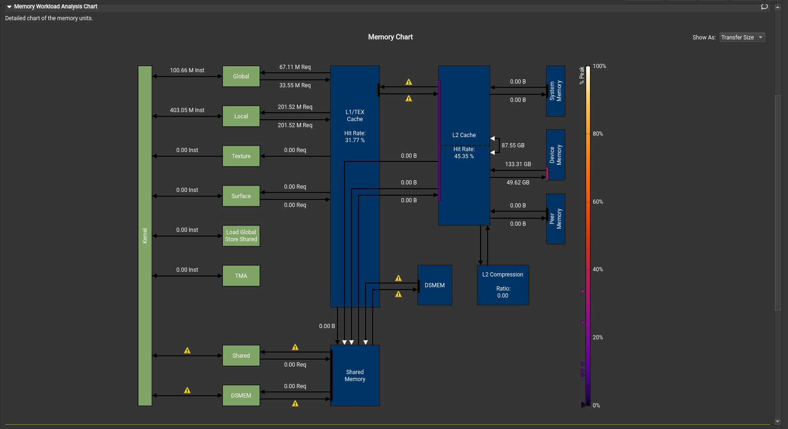
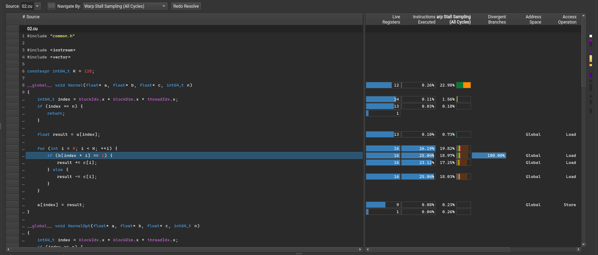
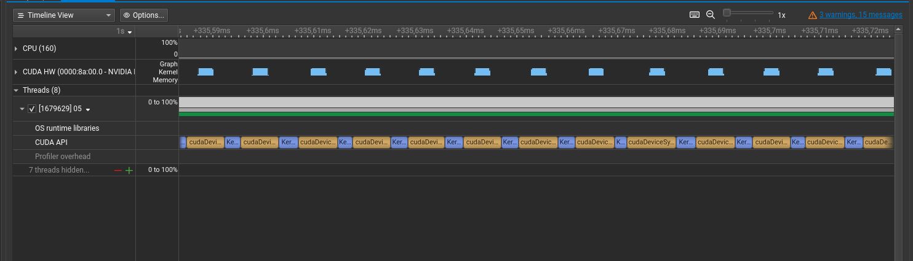
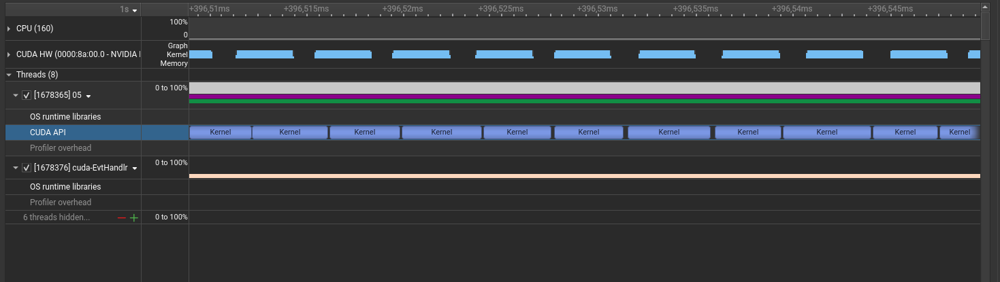
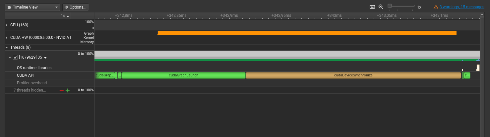
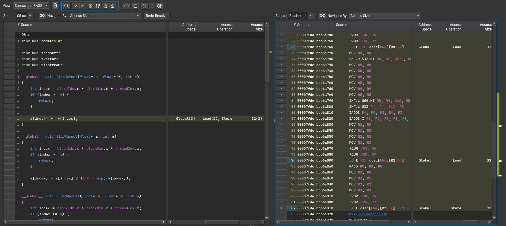

In this lab, you will start learning how to profile GPU workloads and optimize them. This is important because you typically want not just to run some workload on the GPU but also utilize resources of not-so-cheap GPU as much as possible.

## GPU Architecture Background

Before we start, let's first understand the GPU archirecture since it is important to work on CUDA workloads performance.

The GPU architecture is different from the classical computer architecture since they are designed to handle different workloads. CPUs are optimized to handle mostly serial workloads while GPUs are designed to execute the same code on the big amount of data. We will see how it affects the architecture.

The most basic component of the GPU is CUDA core which is similar to the CPU core in sense that it executes instructions in a serial manner. In terms of CUDA programming model CUDA core just executes a single thread of a kernel. The difference is that GPU has much more cores than CPU (for example, NVIDIA H100 almost 17k CUDA cores) but these cores are simpler than CPU cores since they are designed for a specific workload. Also, CUDA cores usually have smaller frequency than CPU cores, so on a single-threaded programs, CPU are usually faster than GPUs even on floating-point operations.

A Streaming Multiprocessor or just SM is a cluster of CUDA cores that can execute multiple threads concurrently. Also, SM contains a set of registers and shared memory that can be used by threads running on the cores of the SM. That is, block of the threads is always executed on a single SM. When a block is assigned to some SM, its threads are divided into warps. A warp is a group of 32 threads that are executed in a [SIMD](https://en.wikipedia.org/wiki/Single_instruction,_multiple_data) manner. There are more than 32 cores in a SM, so SM can execute multiple warps simultaneously. Warp scheduler is responsible for selecting warps to execute on SM.

When warp is executed it is expected that all threads are executing the same instruction simultaneously. If some threads are executing different instructions, then the parallelism and thus the performance is decreased. This is called warp divergence. We will see examples of the warp divergence in this lab later.

Summarizing, GPU consists of a CUDA cores that are groupped into SMs. A block of threads is executed on a single SM and its threads are divided into warps. When warp is exectuted, its threads are running on SM cores.

Another important topic is GPU memory hierarchy. There are many types of memory on the GPU but now we will focus only on some of them.

Global memory is the main memory of the GPU. It is accessible from all the threads, just like a regular RAM. In a previous lab, you already used global memory when allocated it via `cudaMalloc`. Global memory is the largest but slowest memory on the GPU, so it is important to minimize the number of accesses to it. In a modern NVIDIA H100 GPU, the global memory size is 80GB and the bandwidth is up to 3TB/s. This is much more than the CPU memory bandwidth but is still not sufficient for some workloads since the number of threads reading from the global memory in parallel is much higher than in the case of regular CPU programs.

Shared memory is the memory that is located inside the SM and is shared between threads in the block. It is much faster than global memory but it is much smaller than global memory. In a modern NVIDIA H100 GPU, the shared memory size is 164KB per SM and the bandwidth can go up to tens of TB/s. It's worth mentioning that shared memory is not homogeneous and is divided into multiple banks. During the single cycle only one operation per bank can be performed, so different threads should work with different banks to avoid bank conflicts resulting in performance degradation.

The fastest memory on the GPU are registers. Just like in the CPU, registers belong to a single core and thus accessible from the single thread. In a modern NVIDIA H100 GPU, the number of registers per CUDA core is 256.

Also similarly to CPU, there are caches on the GPU. L1 cache is located in the SM and is shared between all the cores (and threads) of it. It sits between SM and main memory and caches data from the global memory that is frequently accessed or was recently written. In NVIDIA H100 L1 cache and shared memory share the same space of the SM, so 256KB of the SM memory can be configurably shared between them.

L2 cache is located near the global memory and is shared between SMs. It caches data from the global memory that is frequently accessed by the SMs. In NVIDIA H100 L2 cache size is 40MB.

This was just a brief overview of the GPU internals. If you are interested in more details, you can read the whitepaper of the architecture of some modern GPU (for example, the one you use). [Here](https://resources.nvidia.com/en-us-tensor-core/gtc22-whitepaper-hopper) is an example of such whitepaper for NVIDIA H100 GPU.

Take a look at the specification of the GPU you have access to. What is the amount of global memory, number of SM and memory bandwidth? How many CUDA cores are there and what is their frequency? Compare it with the characteristics of the regular CPU and RAM.

## NVIDIA Nsight

NVIDIA Nsight is a family of profiling tools by NVIDIA that are used to investigate the performance of the GPU workloads. In this lab, we will look at NVIDIA Nsight Systems and NVIDIA Nsight Compute.

NVIDIA Nsight Systems is a system-wide performance analyzer. It collects events from both CPU, GPU and GPU interconnect and puts them on a single timeline. It is useful to get a bird's eye view of the application performance and understand how wall time is distributed between different parts of the program and devices. On the other side, it does not provide detailed information about what happens inside the kernel like `perf` tool for the CPU workloads. To get a detailed view of the kernel execution, we will use another tool called NVIDIA Nsight Compute.

Both of these tools have excellent documentation (see [Nsight Systems](https://docs.nvidia.com/nsight-systems/) and [Nsight Compute](https://docs.nvidia.com/nsight-compute/)). It is definitely not required to read all of it to use these tools, but it is a good idea at least to look at the list of possible options and metrics that can be collected in order to understand the limitations of these tools. Simple usages of these tools will be shown in this lab later.

## 00: First Steps with Nsight Systems

Now it is the time to make your hands dirty and profile something. In this task you will profile program that is located in file `00.cu`.

Take a look at the code. What does it do?

<details>
<summary> Answer </summary>

This code does the following procedure for 10 times. Allocate a vector of 1000 numbers, do some CPU processing, then do GPU processing. For the GPU processing data is copied to GPU and vice versa.

</details>

Now compile the code with the following command and run the profiling.

```bash
make 00
nsys profile -o 00.prof ./00
```

This will generate a file `00.prof.nsys-rep` with the profiling results. Download it locally if required and open it with NVIDIA Nsight Systems GUI.

You will see a timeline with the CPU and GPU events. Play with it to become comfortable with the tool. Try zooming timeline in and out, clicking on the events to get detailed information. Unroll sections for the CPU and GPU and look at them.

Zoom to the time interval when kernels were executing. You will see something like this.


Look at the CUDA API section of the main thread. You will see alternating long `cudaMemcpy` calls.

Why `cudaMemcpy` calls are so long and why do not we see the kernels here?

<details>
<summary> Answer </summary>

`cudaMemcpy` performs synchronization between CPU and GPU that waits until all the previous GPU operations are finished. So it includes both the real data transfer and waiting for the kernel completion.

You can unroll CUDA HW section and see that most of the `cudaMemcpy` call time is spent on the GPU running kernel and only a small amount of time is spent for copying data.
</details>

Add an explicit `cudaDeviceSynchronize` call after the kernel launch and rerun the profiling. You should see something like this.


Now you can see that most of the CPU time is spent on the `cudaDeviceSynchronize` call waiting for the kernel to finish. Look at the `CUDA HW` timeline. It shows that kernels are executed in the same time as synchronization blocks.

However, not 100% of the time is spent in `cudaDeviceSynchronize` calls. Also, there are gaps between kernel launches at `CUDA HW` timeline, so GPU is not 100% utilized. Let's zoom in and look what happens between kernels. You will see something like this.


`cudaMalloc` and `cudaFree` are the most expensive here, consuming about 85% of the gaps. Do you see any way to get rid of them? Try to implement it and then check the answer.

<details>
<summary> Answer </summary>
You can allocate a buffer once before the first kernel execution and free it after the last. Reusing the memory will save time on memory management here.

The pattern of static memory allocation is actually quite common in the GPU prograaming because programs are often more predictable than CPU ones. It allows to use static memory layout in many cases.
</details>

Look at the gap now. You will see something like this.


`cudaMalloc` and `cudaFree` calls are gone and the gap became much smaller. `cudaMemcpy` is still here because we need to copy data between CPU and GPU. Also there is an empty space on both `CUDA API` and `CUDA HW` timelines. What is it?

<details>
<summary> Answer </summary>

This is regular CPU workload that is not related to the GPU. In our case it is just filling the input vector.

</details>

Actually this can be optimized even more by building a better pipeline. Since CPU and GPU are independent, we can start preparing the next batch of data while the previous one is being processed on the GPU. Since kernel executions are asynchronous, it is not so hard to implement. Try to do it and check if the gap became even smaller.

Pipelining is a common pattern when optimizing GPU (and not only GPU) workloads. When optimizing a chain of different operations it's a good idea to look at the pipeline first and get rid of possible unnessesary barriers before optimizing the operations themselves.

This trick can be even performed with `cudaMemcpy` calls in some cases by using `cudaMemcpyAsync` function. It is a little bit tricky sometimes because may lead to races and we will not use it during our course. However, I recommend you to take a look at it.

Now, when everything look good at system-wise level, let's go deeper and profile the kernel itself. It can be done with the following command. This command may take a while to execute, so you can reduce the number of kernel runs to make it faster.

```bash
ncu --set full -o 00.prof ./00
```

`--set full` option tells Nsight Compute to collect all the possible metrics. This will allow you to look at all the profiler capabilities, but has a big performance overhead and produces profiles of a big size. In future exercies it's recomended to use more specific metrics. Usually, it's a good idea to start with the basic set of metrics (without providing `--set` option) and then add more metrics if needed.

The command will generate a file `00.prof.ncu-rep` with the profiling results. Let's inspect it with NVIDIA Nsight Compute GUI. Note, that Nsight Compute GUI is a different program than Nsight Systems GUI and one will not open profiles of the other.

Let's explore the profile. On the summary tab you will see all the kernel launches. For each of them name, duration, thread count and other basic metrics are shown.

When trying to optimize the kernel, one of the important things to understand is whether the kernel is memory bound or compute bound. Compute bound kernels are kernels that are limited by the computational capabilities of the GPU (i.e. if the number of operations per second of CUDA cores increases the kernel execution time will decrease). Memory bound kernels are limited by the memory bandwidth of the GPU (i.e. if the number of memory accesses per second increases the kernel execution time will decrease).

You can double click on the launch to see detailed information on the details tab. It has different metrics as well as some perfomance improvement advices. At the first glance, it may look like a spaceship control panel with many different metrics and warnings. Note, that many of the warnings may be false positives, so make sure that something is really a problem before trying to fix it.

Look at the "Launch Statistics" section. Nsight Compute already found what the problem is and tells us that block size is too small. Try to fix it according to a suggestion and set the number of threads per block to 256. Rerun the profiling and compare the results. You should see a significant speedup.

For example, consider the message "Low Utilization" in "Compute Workload Analysis". What does it mean? Why did it happen? How can you fix it?

Fix the problem and rerun the profiling. Compare workload analysis before and after the fix. Did your fix help?

<details>
<summary> Answer </summary>

Error message means that warps are not fully utilize the compute. This is because we have only one thread per block, so the warp is not full and we do not take advantage of the SIMD processing. To fix it, increase the number of threads per block to, say, 256.

</details>

That's it for now! You did your first kernel optimizations using NVIDIA Nsight. Before moving to the next task, I suggest you to play a little bit with Nsight Systems and Nsight compute to get more familiar with them. Try to change kernel in some ways and see how it affects the performance and profiler metrics. Try to change the size of the array to make operation more heavy or try to make the kernel memory-bound by changing the number of iterations in the kernel.

If you want to go even deeper with these tools read the official documentation or watch some tutorials on the NVIDIA YouTube channel with useful features and tricks.

## 01: Coalescing Memory Access

In this task, you are provided a kernel that sums up two vectors. The kernel is located in the file `01.cu`.

Take a look at the code. Unlike the program we wrote in a previous lab, the number of elements in the vector is greater than the number of threads in the block. Each thread is responsible for summing up a consecutive range of the vector elements. Compile the program and run the profiling with `ncu -o 01.prof ./01`. This will be faster than the profiling in the previous task since we disabled most of the metrics. Now, on Details tab, Nsight tells us that there are some latency issues since both compute and memory utilization are low.

Let's rerun the profiling with `--section MemoryWorkloadAnalysis_Chart --section MemoryWorkloadAnalysis_Tables --section SpeedOfLight` to collect more metrics and memory usage pattern. By the way, you can run `ncu --list-section` to see all the possible metric groups.

At first, you can take a look at nice memory workload chat that looks like this.



It shows how much data was transferred between different levels of memory hierarch and at which speed. That may be useful to understand the cache hit of some kernels, for example.

Now, move on to the memory workload analysis tables. You can see multiple warnings about the memory access patterns, read them. What is the problem with the kernel?
<details>
<summary> Answer </summary>
Remember that threads are grouped in warps and warps are executed at the SM in a SIMD manner. Consider a warp of first 32 threads. Let's see which elements are accessed during the first instruction.

Let $k$ be the total number of threads. Then the first thread accesses element $0$ during the first instruction. The second thread accesses element $n / k$, the third accesses $2n / k$, etc. These accesses are not coalesced (despite the fact that the read pattern of the threads is coalesced), so this is the reason of wasted memory bandwidth since during the memory fetch a whole cache line of 128 bytes is read but only 8 bytes are used.

</details>

How to fix the problem?

<details>
<summary> Answer </summary>

Ensure that all threads in a warp access consecutive memory locations during a step. Consider a warp of the first 32 threads again. During the first instruction we want them to access elements $0, 1, 2, \ldots, 31$. During the second instruction we want them to access elements $p, p + 1, p + 2, \ldots, p + 31$ for some $p$ and so on. A good choice of $p$ is the number of threads for example (let it be $k$). In this case, thread with number $i$ will process elements with numbers $i, i + k, i + 2k, \ldots$.

</details>

Rewrite `AddVectorsKernelOpt` to make the memory access pattern coalesced. Run the program again. You should see a great decrease in the execution time. Run the profiling again. You should see that memory throughput became 80+% and there are no more issues on the details tab. Note, that compute utilization is less than memory utilization. Why is it so?

<details>
<summary> Answer </summary>
This kernel is memory-bound but not compute-bound since the processing in each thread is very simple compared to data fetch from the global memory.
</details>

Also, note that we run every kernel for 3 times. This is not a mistake. The first run can be slow sometimes because of the "cold start" effects. You should always run the kernel for a few times during profiling to make sure that there are no effects of a "cold start" and that the execution time is stable across different runs.

Good job! You have optimized the CUDA kernel by understanding memory hierarchy of the GPU!

## 02: Thread Divergence

Open the file `02.cu`. Look at the `Kernel` kernel and try to understand what it does.

<details>
<summary> Answer </summary>
This kernel performs some convolution-like operation. For every $i$ it adds to $a_i$ the value $\sum_{j = 0}^{N - 1} F(b_{i + j}, c_j)$, where $F(1, x) = x$ and $F(0, x) = -x$.
</details>

Let's profile the kernel with `ncu -o 02.prof ./02` and see what can we do here. The first notable thing is that the kernel is compute-bound, compute utilization is almost 100% while memory utilization is quite low. This is not surprising since the kernel does quite a lot of computations and ranges parts of $b$ and $c$ are cached in L1 and L2 (Do not trust me! Check it yourself by running memory profiling).

To find out what are the compute bottlenecks of the kernel, rerun the profiling with `--section ComputeWorkloadAnalysis --section InstructionStats --section WarpStateStats`. You will see a bunch of warnings including the one about the warp divergence. What is the problem with the kernel?

<details>
<summary> Answer </summary>
Remember that threads are grouped in warps and all the threads in a warp can execute only the same instruction at the moment. In our case, there is an `if` in kernel code that makes threads execute different instructions depending on the value of `b[i + j]`. This reduces the performance since during the execution of the kernel instructions `result += c[i];` and `result -= c[i];` are executed sequentially for the warp, not in parallel for different threads.
</details>

Imagine that we did not find this problem ourselves. Let the profiler help us an rerun the profiling with `--section WarpStateStats` and `--section SourceCounters`. This will be slower but it will make the profiler join the hardware events with the source code, so we can find out which instructions are the reason for the warp divergence.

Open the profile viewer, select any run of the kernel and go to source tab. In case if you are viewing the profile on other host rather than running kernels, you should click on the `Resolve` button and provide `02.cu`. Select `Source` in menu `View` and `Warp Stall Sampling` in `Navigate By`. You will see something like this.



For every line of the source code (and resulting SASS assembly code if needed), profiler provides different statistics, for example information about global or local memory accesses or starts of the divergent branches. It's clear that all the divergences are caused by the `if` statement. Spend some time playing with the `Source` tab to get familiar with it.

How to fix the problem? Rewrite `KernelOpt` to avoid warp divergence. Run the code again and see that code runs faster. Rerun the profiling and see that the warp divergence warning is gone.

<details>
<summary> Answer </summary>
`F(p, x)` is actually $(2p - 1) \cdot x$, so you can just replace `if` with `result += (2 * b[i + j] - 1) * c[j];`.
</details>

# 03: Negative Complexity

Open the file `03.cu`. Look at the `Kernel` kernel and try to understand what it does.

<details>
<summary> Answer </summary>
This kernel fills an array `a`` of size `n` with 100 in a little bit weird but correct way.
</details>

There are two runs of the kernel in the code. The first run is with `N1 = 1024` and the second one is with `N2 = 1000`. Run the code. You can see that the first one is faster by about 10%. This is contrintuitive since the number of elements is bigger in this case. Why is it so?

<details>
<summary> Answer </summary>
If statement checking if index is bigger than n is not executed in case of N = 1024, since 1024 is divisible by a block size and warp size. In case of N = 1000, the statement is executed for the last warp leading to the warp divergence.
</details>

Here you can see in important property of the massively parallel computation. The latency of the execution is the latency of the slowest thread or a warp. It is sufficient to have only one thread that is slow to make all the kernel slow and wasting the resources of the GPU.

Another manifestation of this issue is the case if the number of blocks is a little bit bigger than the number of SMs. In this case, after the first batch of blocks is executed, only a small number of SMs will be used leading to the underutilization of the GPU. This can be fixed either by changing the number of blocks or by building better pipelines so there is no barrier after the kernel and the next kernel can be run without waiting for the previous one to complete.

This story is one of the reasons why it is advisable to make all the layer sizes in deep learning models divisible by a large power of 2. All the threads are becoming more homogeneous and there are less number of divergences of the threads.

# 04: Streams and Graphs

Open the file `04.cu`. Look at the `DoSlow` function and try to understand what it does.

<details>
<summary> Answer </summary>
This function adds 100 to all the elements of the array `a`` of length `n` by executing kernel that adds 1 for 100 times.
</details>

This can be definitely optimized by writing a kernel that adds 100 to all the elements, but it will be too boring. Let's try to optimize the code keeping 100 kernel launches.

Profile the code using `nsys` by using the command `nsys profile -o 05.prof ./05`. Open the profile and zoom in to the kernel invocations. You will see something like this.



GPU is definitely underutilized here, there are big gaps on the `CUDA HW` timeline. This is because synchronization between CPU and GPU is required on kernel launch and waiting for the kernel to finish.

We want to launch multiple kernels at once but make sure that the next kernel execution starts only after the previous one is finished (to be honest, in this synthetic example it is not mandatory, but for the most of the real-world cases it is). This can be done by using CUDA streams. CUDA stream is a queue of the GPU commands that are executed in order but each command is launched only after completion of the previous one. Commands from different streams can be executed concurrently.

To create a CUDA stream add the following code.
```cpp
cudaStream_t stream;
CUDA_CHECK_ERROR(cudaStreamCreate(&stream));
```

As all other objects in CUDA, streams should be destroyed after usage.
```cpp
CUDA_CHECK_ERROR(cudaStreamDestroy(stream));
```

To launch a kernel in a stream, you need to use the extended syntax of the kernel launch. Typically we used `<<<Blocks, Threads>>>` syntax. Now we need to use `<<<Blocks, Threads, 0, stream>>>` syntax. The last argument is the stream in which the kernel should be executed. The third argument is the size of the dynamic shared memory which we will not use in this course.

Try to implement the stream-based version of the code in the `DoStream` function. Uncomment its usage in `main` and run the code. You should see that the execution time is decreased. Rerun the `nsys` profiling and look at the timeline. It should look like this.



Now the GPU gaps became much smaller, but the utilization is still not 100%. This is because of some inter-GPU synchronization between launches.

This can be further optimized by using CUDA graphs. CUDA graph is a set of nodes that can be kernel launches, memory copies, or other operations. There are dependencies between the nodes and the node is guaranteed to be executed only after all the dependencies are finished, which allows to describe more complex computations than with streams. CUDA tries to run such a graph in the most optimal way possible by, for example, running some nodes concurrently, if possible.

There are two ways to describe the CUDA graph. Implicit way is to capture all the activity that was performed in some stream and then replay it in the graph. Explicit one requires to describe the nodes and dependencies manually. In our case, implicit way is sufficient and easier.

Use
```cpp
CUDA_CHECK_ERROR(cudaStreamBeginCapture(stream, cudaStreamCaptureModeGlobal));
```

to start capturing activity in some stream. Note, that after running of this command all the activity in the stream is captured but not actually launched.

To end the capture and store the activity in the graph use
```cpp
cudaGraph_t graph;
CUDA_CHECK_ERROR(cudaStreamEndCapture(stream, &graph));
```

Finally, use
```cpp
cudaGraphExec_t graphExec;
CUDA_CHECK_ERROR(cudaGraphInstantiate(&graphExec, graph, 0));
```

to compile the graph. After the graph is compiled, you can run it with
```cpp
CUDA_CHECK_ERROR(cudaGraphLaunch(graphExec, 0));
```

Note, that graph lauch is asynchronous and you may need to use `cudaDeviceSynchronize` after.

To destroy the graph use
```cpp
CUDA_CHECK_ERROR(cudaGraphExecDestroy(graphExec));
CUDA_CHECK_ERROR(cudaGraphDestroy(graph));
```

Try to implement graph control flow in the `DoGraph` function. Uncomment its usage in `main` and run the code. You should see that the execution time is decreased even more. Rerun the `nsys` profiling and look at the timeline. It should look like this.



There is no per-kernel detalisation in the timeline since all the kernels are fused into the single entity. However, you can now see that GPU is utilized all the time. Let's have a look at what is going on inside the graph. Profile the code with `ncu -o 05.prof ./05`. You may find useful to disable `DoSlow` and `DoStream` functions in the code since `ncu` is slow if many kernels are launched. Also, you can lower the number of kernel launches in the `DoGraph` function to make profiling faster.

Open the profile in the Nsight Compute. You will see just a number of your kernel launches without any changes. This is because graph API is about the flow of kernels, not the kernels themselves.

Joining kernel launches using streams and graphs is a popular way to optimize GPU workloads. Again, this is possible because GPU workloads are more predictable than the CPU ones, so you can build a static graph of the computation.

## 05: Explicit CUDA Graphs

Open the file `05.cu`. Look at the `DoSlow` function and try to understand what it does.

<details>
<summary> Answer </summary>
This is a (little bit weird) way to find the sum of the elements of the array using CUDA. For N which is a power of two it puts input elements on the positions from N to 2N - 1 (inclusive) and then tracts the array as a full binary tree of depth log(N). The root of this tree is a element 1, the leaves are the elements of the input array on positions from N to 2N - 1 and the internal node i has two children: 2i and 2i + 1.

Algorithm puts the sum of the leaves in the subtree to every node. So, the root will contain the sum of all the elements of the array. To do so, it goes from the deep levels of the tree to the root and sets the value of the parent node to the sum of the values of its children. You can see how is it done in `DoSlow` function.
</details>

Do you see how this can be optimized?

<details>
<summary> Answer </summary>
Note, that all the kernels are executed sequentially. However, there is no data dependency between nodes of the same level of the tree. Ideally, this algorithm should consist of log(N) phases with i-th phase launching all the kernels of the i-th level of the tree.
</details>

We cannot express such control flow via stream capturing since it is just a queue. To express such control flow we need to use explicit CUDA graphs. Let's have a look at how to do it.

To create an empty graph, use
```cpp
cudaGraph_t graph;
CUDA_CHECK_ERROR(cudaGraphCreate(&graph, 0));
```

A node with the kernel (and possibly some dependencies) can be added to the graph with [cudaGraphAddKernelNode](https://docs.nvidia.com/cuda/cuda-runtime-api/group__CUDART__GRAPH.html#group__CUDART__GRAPH_1gcbdee72d9f3b4ce17654ee197fc02651) function. I intentionally provide just a link to the documentation here. Reading official NVIDIA documentation is an important skill if you want to work with CUDA.

After you added all the nodes to the graph, you can compile it with `cudaGraphInstantiate` and run it with `cudaGraphLaunch` just like before.

Implement `DoFast` function to speed up the algorithm. Uncomment its usage in `main` and run the code. You should see that the execution time is decreased.

## 06: Kernel Fusion

Open the file `06.cu`. Look at the `DoGraph` function and try to understand what it does.

<details>
<summary> Answer </summary>
This is a part of some neural network. It adds bias vector to the input vector and applies the SiLU activation function. To make things faster kernels are executed via CUDA graph.
</details>

Let's try to make it faster by fusing the kernels, i.e. implementing a single kernel that does the job. Why will it be faster?

<details>
<summary> Answer </summary>
Fusing kernels will reduce the number of memory transfers since in case of two kernels there are 4 transfers of the data between global memory and SMs: two for the input and output of the first kernel and two for the input and output of the second kernel.

In case of the single fused kernel there are only two transfers.
</details>

Fusing the kernels is a popular way to optimize GPU workloads. Try to implement the fused kernel in the `DoFused` function. Uncomment its usage in `main` and run the code. You should see that the execution time is decreased.

Now convience yourself that the size of the data trasfered is reduced by profiling the code with `--section MemoryWorkloadAnalysis_Chart --section MemoryWorkloadAnalysis_Tables --section SpeedOfLight`.

You should see about 12GB of the data transfered for `BiasKernel` (2x input for `a` and `w` and 1x output for the `a`), about 8GB of the data transfered for `SiLUKernel` and about `12GB` of the data transfered for the newly implemented kernel. That is, amount of data transfered was lowered by 40%.

You can also inspect particular kernel and find the instructions that are leading to global memory read or write on the source tab if add `--section SourceCounters` to the `ncu` command.

It looks somewhat like this.



You can see the load and store commands both in the source code and low-level SASS code.

Also it's worth mentioning what is the difference between SASS and PTX code. PTX (Parallel Thread Execution) is a higher level assembly language that your C++ code is compiled to. It is usually more readable and portable between different architectures. SASS (Streaming Assembler) is a low-level assembly language that is executed by the GPU. It is compiled from PTX and is specific to the architecture of the GPU. By default, PTX is converted into SASS in the runtime using JIT (just-in-time) complitation. However, by using `nvcc` with the `-gencode` flag you can compile your code directly to SASS but the resulting binary will be less portable.
