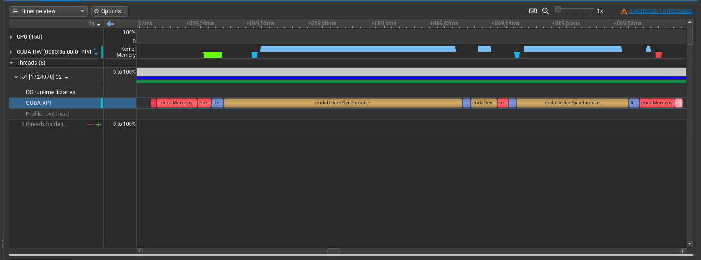

In this lab, you will implement inference of your first neural network in this course!

## MNIST Network

In this lab, we will work with one of the simplest neural networks: two-layer neural network for digits classification.

We will use [MNIST dataset](https://huggingface.co/datasets/ylecun/mnist), which contains 28x28 grayscale images of handwritten digits (0 through 9).

Our neural network will have the following architecture. The input of the neural network is a 28x28 grayscale image which is represented as a vector of 784 = 28x28 floats where each float describes a color. The first linear layer is a pair of matrix $W_1$ of size 784x1000 and a vector $b_1$ of size 1000. In coverts input vector $\text{in}$ to the vector of size 1000 using the transformation $\text{in} \cdot W_1 + b_1$. After the first linear layer, activation function ReLU is applied to the resulting vector of size 1000. ReLU of a vector is just a pointwise function $a'_i = \max(a_i, 0)$. Finally, after ReLU to the vector of size 1000 the second linear layer is applied. Its structure is the same as the first layer, but the size is different: $W_2$ is of size 1000x10 and $b_2$ is of size 10. The output of the neural network is the vector of size 10, which represents the probabilities of the input image to be a digit from 0 to 9. The output of the neural network is computed as $\text{out} = \text{ReLU}(\text{in} \cdot W_1 + b_1) \cdot W_2 + b_2$.

This neural network is simple but capable to recognize digits with quite high accuracy.

## 00: Train the Network

Before starting working on inference we need to get the data and train the network.

Run the `train.py` script to train the network. This script will download the MNIST dataset, train the network and produce two output files in the `data` directory: `model.bin` contains serialized weights of the model and `test.bin` contains serialized test dataset that we will use for inference.

## 01: CPU Inference

In this task, you will run the inference of the neural network you trained on the CPU. We start with the CPU because it is easier to implement and will help you to get used to the primitives used in this lab.

Open the `01.cpp` file. Your goal is to complete `EvalNetwork` function. Take a look at the `common.h` file to find out what is stored inside the `TMNISTNetwork` and `TImage` structures, also look at the `TestMNISTNetwork` implementation.

Hint: take a look at the Weights matrix in the linear layer. It is [transposed](https://en.wikipedia.org/wiki/Transpose) to make matrix multiplication more efficient. Why does it help?

<details>
<summary> Answer </summary>

When matrices $A$ and $B$ are multiplied, access pattern for the elements of $A$ is sequential, but for the elements of $B$ it is not since we are iterating over columns. When $B$ is transposed to $B^T$ the access pattern becomes sequential for both matrices.
</details>

After you are done, compile the code using `make 01` and run the `01` binary. You should see the output like this:

```
Accuracy: 975 / 1000 = 0.975
Accuracy: 1934 / 2000 = 0.967
Accuracy: 2894 / 3000 = 0.964667
Accuracy: 3860 / 4000 = 0.965
Accuracy: 4827 / 5000 = 0.9654
Accuracy: 5808 / 6000 = 0.968
Accuracy: 6795 / 7000 = 0.970714
Accuracy: 7786 / 8000 = 0.97325
Accuracy: 8779 / 9000 = 0.975444
Accuracy: 9756 / 10000 = 0.9756
Final Accuracy: 9756 / 10000 = 0.9756
Elapsed time: 8955 ms, Time per batch: 0.8955 ms, Images per second: 1116.69 imgs/s
```

If the final accuracy is more than 90%, good job, you wrote your first inference code in this course! If not, something is wrong, try to find the bug.

## 02: CUDA Inference

All right, now it is time to run the inference of our model on the GPU. Everything should be familiar for you in this task, you just need to write a bunch of kernels.

When running inference, especially of the small models, it is a common practise to use batching, i.e. process multiple inputs at once. This is because the infernce of a single input does not usually utilize the GPU completely, so we can add one more dimension to the parallelism by selecting the batch size. In this task the batch size is set to 64 but you are welcome to play with this constant and see how it affects the performance.

Open the `02.cu` file. Take a look at the `TGpuMNISTNetwork` class which represents the model on the GPU that evaluates the model layer by layer. Your task is to implement the `Apply` function for different layers.

Let's start with something simple. Take a look at the `TGpuReLULayer`, it takes `TGpuMatrix` as input, tracts it as a `BatchSize` vectors of size `Size` with each vector being a row of this matrix and applies `ReLU` activation function to it. Look at the `TGpuMatrix` implementation in the `common.h` file, it is just a wrapper over GPU-allocated array of floats. Implement `Apply` function for this layer. You should implement `ReLUKernel` and call it from the `Apply` function. This is not tricky, you should be already experienced with it.

Now let's move to the `TGpuArgMaxLayer`. It takes `TGpuMatrix` as input and also tracts it as a `BatchSize` vectors of size `Size` just like `ReLU` layer. For each vector in the batch, it finds the index of the element with the maximum value and stores it to the corresponding element of the output vector. Implement `Apply` function for this layer which is again an implementation of the `ArgMaxKernel` and a kernel launch. Hint: since the sizes of input vectors here are small (they are always 10 since it is the output dimension of the network) you can process each vector in a single thread.

Now it's time for the linear layer. Take a look at the `LinearLayerKernel` function description which tells what you need to implement in detail. Note, how the biases are added: matrix `C` becomes initially filled with `BatchSize` copies of the bias vector in the `Apply` function, so we need to add to the matrix `C` value `A \cdot B^T` (note, that `B` is transposed). Implement the `Apply` function for the `TGpuLinearLayer` class as well as the `LinearLayerKernel` function. Note, that the `Apply` function contains `#ifdef CUBLAS` block, assume it to be disabled for now, we will use cuBLAS in the next task.

After you are done, compile the code using `make 02` and run the `02` binary. Again, you should see accuracy of 90+% and the perfomance greatly improved compared to the CPU version.

Let's look what the GPU is doing during the inference. Try to guess what is the most expensive here and then profile the resulting code with `nsys` tool. Inference of one batch should look like this.



We can see the lack of pipelining and the GPU doing nothing between the layers. Also, the `LinearLayerKernel` is the most expensive part of the inference.

The first problem can be fixed by using CUDA grpahs just like in the previous lab, we will not do it nothing since it is not too interesting, but you can try if you are interested. Now we will focus on the second problem and instead of optimizing the kernel just like in the previous lab, we will use special library for matrix multiplication called cuBLAS.

## 03: cuBLAS Inference

Note, in this task we will continue to work in `02.cu` file, but use `make 03` to build the binary since we need to add `-DUSE_CUBLAS` flag to the compiler.

[cuBLAS](https://developer.nvidia.com/cublas) (CUDA Basic Linear Algebra Subroutines) is a library that provides optimized implementations of many common linear algebra operations including matrix multiplication. It is achieved both by using efficient algorithms and using hardware capabilities of the GPU, for example, tensor cores that are special cores designed for matrix multiplication (you can learn more about them in Hopper architecture [specification](https://resources.nvidia.com/en-us-tensor-core)).

In this task we will rewrite linear layer using cuBLAS.

The routine we need to use is called GEMM (GEneral Matrix Multiplication). For matrices $A$ of size $n \times k$, $B$ of size $k \times m$ and $C$ of size $n \times m$ it implements $C = \alpha A \cdot B + \beta C$ where $\alpha$ and $\beta$ are scalars. Note, that with $\alpha = \beta = 1$ this is exactly the `LinearLayerKernel` function we implemented in the previous task.

Before we move to the implementation let's look at some important details about cuBLAS.

The first (and probably the most annoying) thing is that cuBLAS uses [column-major](https://en.wikipedia.org/wiki/Row-_and_column-major_order) order of elements in matrices while we always used row-major. The reason for this is historical. Back in the distant 1970s, [BLAS](https://en.wikipedia.org/wiki/Basic_Linear_Algebra_Subprograms) library for linear algebra operations was created. In these times the most popular language for scientific computing was Fortran that used column-major order, so BLAS used it also. cuBLAS was created as a GPU-accelerated version of BLAS, so for the sake of compatibility it inherited column-major order.

Two other things are less problematic. The first one is that the way to handle errors in cuBLAS is different from the CUDA, so make sure to wrap all cuBLAS calls into the `CUBLAS_CHECK_ERROR` macro defined in `common.h`. The second one is that cuBLAS library has a context that should be passed to all the cuBLAS calls. Context is created via `cublasCreate` call and destroyed via `cublasDestroy` call. Context is already created and passed to the linear layer so you do not need to worry about it.

Now we can move to the implementation. We will use [cublasGemmEx](https://docs.nvidia.com/cuda/cublas/#cublasgemmex) function. Take a look at the long list of the arguments and try to call it properly. Be careful with `transa` and `transb` arguments, they are assuming column-major order, so the matrix that is transposed in a row-major order is not transposed in a column-major order and vise-versa. You may find useful that $A^T \cdot B^T = (B \cdot A)^T$.

After you finish, run the model inference to check if everything is correct.

Now run the profiling with `nsys` to see what has changed. You should notice that the `LinearLayerKernel` was replaced for cuBLAS kernels that are faster.
